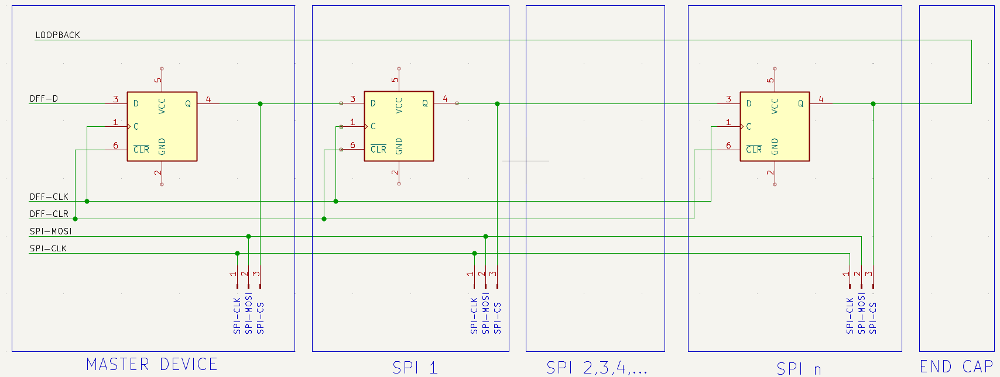
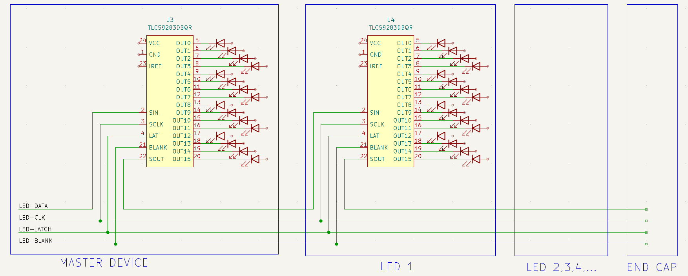
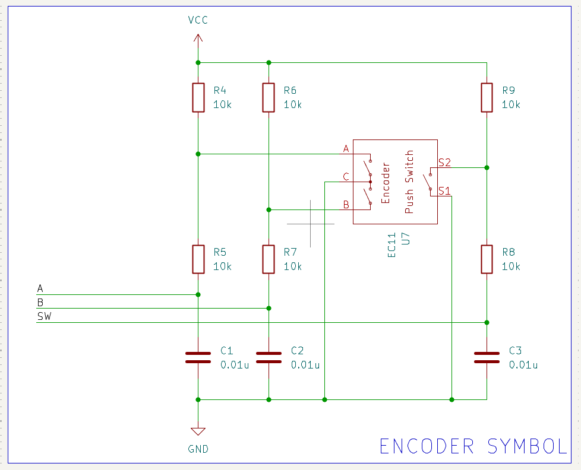
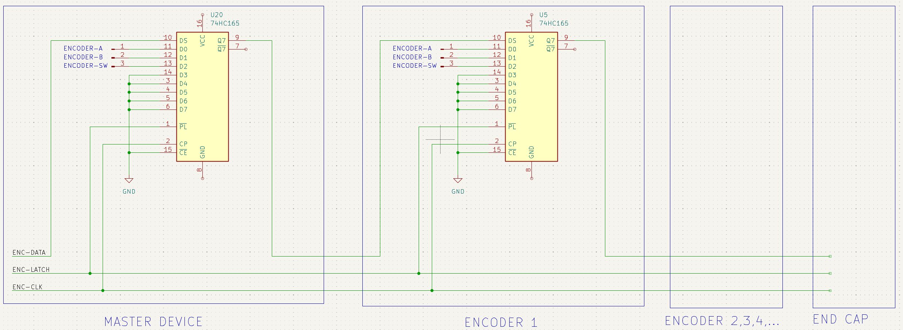
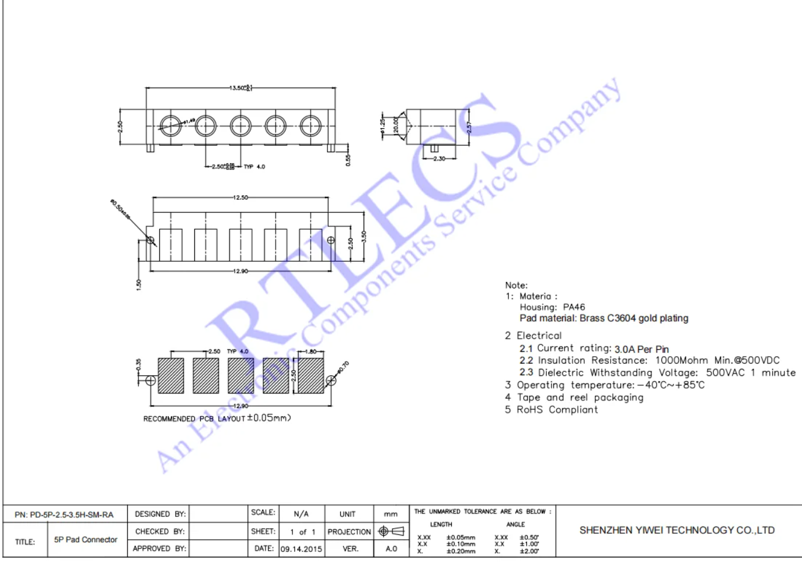
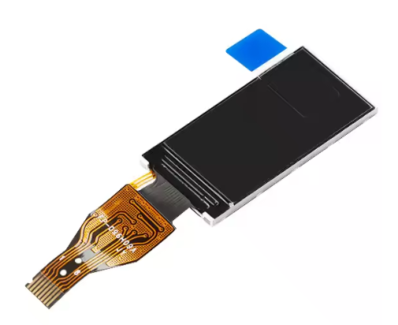
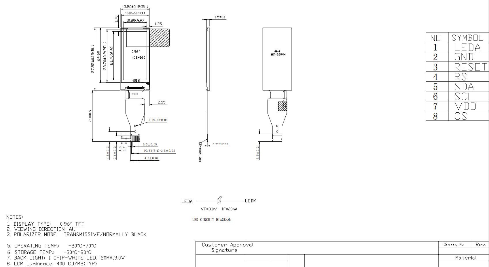
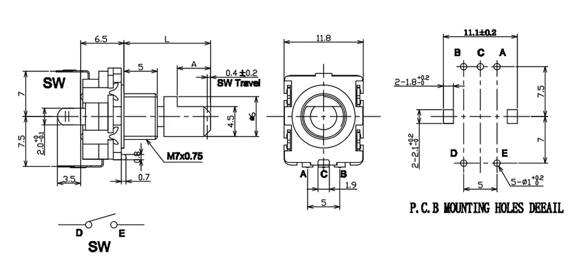

# PCB詳細設計
## 通信仕様
- モジュールあたり15pinのデイジーチェーン接続
  - 5pin ポゴピン x 3
1. 3.3V
1. GND
1. DISPLAY-LOOPBACK
1. DISPLAY-DFF-D
1. DISPLAY-DFF-CLK
1. DISPLAY-DFF-CLR
1. DISPLAY-SPI-MOSI
1. DISPLAY-SPI-CLK
1. LED-DATA
1. LED-CLK
1. LED-LATCH
1. LED-LATCHBLANK
1. ENC-DATA
1. ENC-LATCH
1. ENC-CLK

### SPI通信

### レベルメータ

### ロータリーエンコーダ

## 注文部品(AliExpress) 
### ポゴピン
- [https://ja.aliexpress.com/item/1005003656767263.html](https://ja.aliexpress.com/item/1005003656767263.html)
  - カラー: 5Pin Male Female

### 液晶
- [https://ja.aliexpress.com/item/1005005382511104.html](https://ja.aliexpress.com/item/1005005382511104.html)
  - カラー: Spliced Type

### ロータリーエンコーダ
- [https://ja.aliexpress.com/item/1005005983134515.html](https://ja.aliexpress.com/item/1005005983134515.html)
  - カラー: 15mm Half handle

## マスターデバイス
### 構成要素
- type-C端子(メス)
  - 給電，USB通信用
- XH 4pin (メス)
  - UART隠し端子用
- RP2040
  - 制御用
- 8ピン 0.5mmピッチZIFコネクタ
  - 液晶FPC用
- 2x スイッチ付ロータリーエンコーダ
  - マスターボリューム用
  - ページ送り用
- 3x 5pinポゴピン (メス)
  - デイジーチェーン通信用
- 16x チップLED
  - レベルメータ用
  - 赤1橙5緑10

## スレーブデバイス
### 構成要素
- 8ピン 0.5mmピッチZIFコネクタ
  - 液晶FPC用
- スイッチ付ロータリーエンコーダ
  - ボリューム用
- 3x 5pinポゴピン (オス)
  - デイジーチェーン通信用
- 3x 5pinポゴピン (メス)
  - デイジーチェーン通信用
- 16x チップLED
  - レベルメータ用
  - 赤1橙5緑10

## エンドキャップ
### 構成要素
- 3x 5pinポゴピン (オス)
  - デイジーチェーン通信用